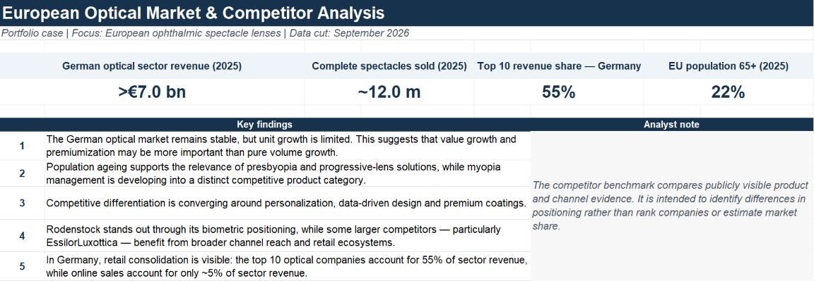
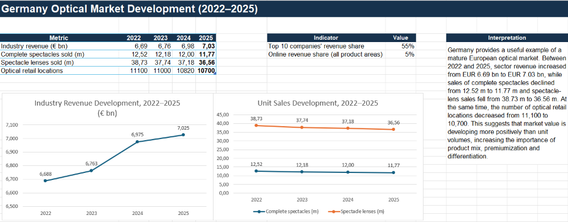
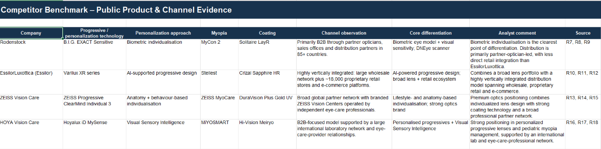

**Portfolio project | Market Intelligence | September 2026**

# European Optical Market & Competitor Analysis
Market intelligence portfolio case analysing the European ophthalmic spectacle-lens market, German market dynamics and competitive positioning of Rodenstock, EssilorLuxottica, ZEISS and HOYA.

> **Focus:** European ophthalmic spectacle lenses  
> **Deep dive:** German optical market  
> **Companies:** Rodenstock · EssilorLuxottica · ZEISS · HOYA

## Project objective

The goal was to analyse market dynamics, competitive positioning and
selected strategic implications for a premium spectacle-lens manufacturer.

The project combines:
- secondary market research
- Excel-based market analysis
- competitor benchmarking
- channel analysis
- strategic interpretation

## Scope

The core analysis focuses on European prescription spectacle lenses.

A broader ophthalmic-lens forecast is used only as external context because
the source also includes contact lenses and intraocular lenses.

Germany is used as a transparent mature-market deep dive.

## Key findings

### 1. Germany shows a value-versus-volume gap

Between 2022 and 2025:
- industry revenue: EUR 6.69bn → EUR 7.03bn (+5.0%)
- complete spectacles: 12.52m → 11.77m (-6.0%)
- spectacle lenses: 38.73m → 36.56m (-5.6%)

This suggests that market value has been more resilient than physical volume.

### 2. Personalisation is a common competitive theme

Rodenstock, Essilor, ZEISS and HOYA all use biometric, behavioural or
wearer-specific inputs in premium lens design.

Rodenstock's distinctive positioning is its biometric measurement approach.

### 3. Pediatric myopia management is a distinct competitive category

Representative platforms include:
- Rodenstock MyCon 2
- Essilor Stellest
- ZEISS MyoCare
- HOYA MiYOSMART

### 4. Channel models differ materially

EssilorLuxottica combines wholesale with a large proprietary retail and
e-commerce footprint, while Rodenstock, ZEISS and HOYA rely more strongly
on professional partner networks.

## Competitor benchmark

| Company | Personalisation | Myopia management | Premium coating |
|---|---|---|---|
| Rodenstock | B.I.G. EXACT Sensitive | MyCon 2 | Solitaire LayR |
| Essilor | Varilux XR | Stellest | Crizal Sapphire HR |
| ZEISS | ClearMind Individual 3 | MyoCare | DuraVision Plus Gold UV |
| HOYA | Hoyalux iD MySense | MiYOSMART | Hi-Vision Meiryo |

## Deliverables

- [Excel analysis](analysis/European_Optical_Market_Competitor_Analysis.xlsx)
- [Full report](report/European_Optical_Market_Competitor_Analysis_Report.pdf)
- [Portfolio presentation](presentation/European_Optical_Market_Portfolio_Presentation.pdf)

## Skills demonstrated

Microsoft Excel · Secondary Research · Competitor Analysis · Market
Intelligence · Data Visualisation · Strategic Analysis

## Data sources

Main public sources include:
- ZVA Branchenbericht 2025/2026
- Eurostat
- Global Market Insights
- Rodenstock
- EssilorLuxottica / Essilor
- ZEISS Vision Care
- HOYA Vision Care
- selected scientific literature

Full source references are available in the report and Excel workbook.

## Limitations

This is a desk-research portfolio project based on publicly available
information. Market definitions differ across public sources, and product
claims are not directly comparable when manufacturers use different testing
methods.
